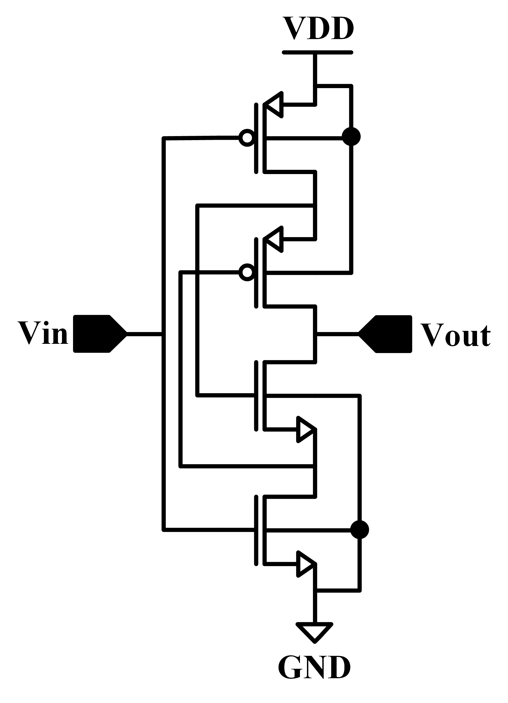
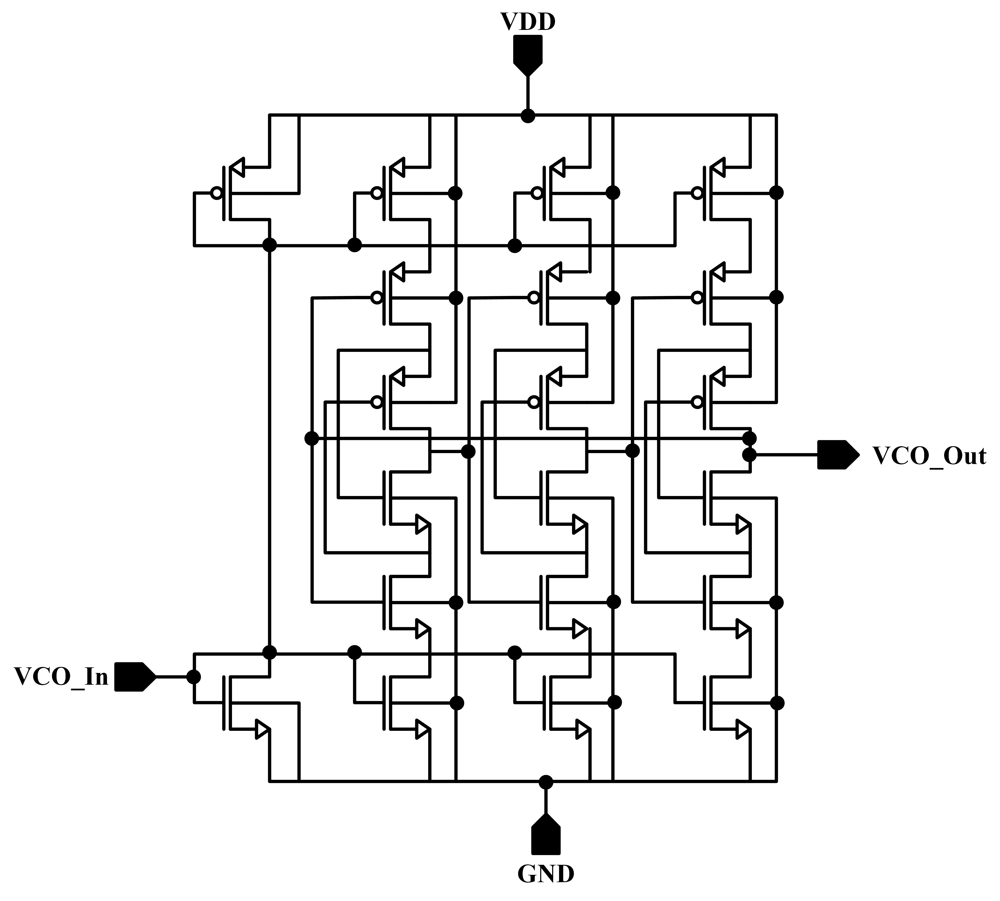
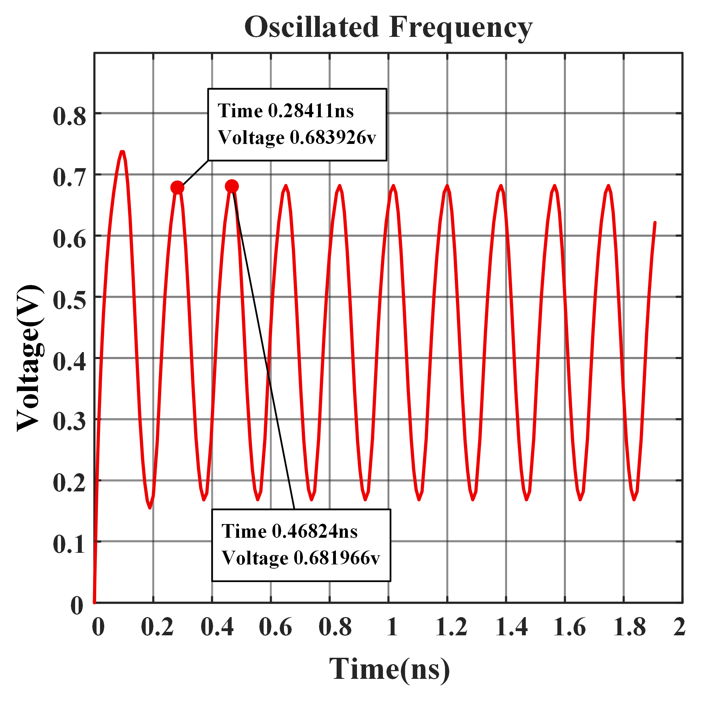
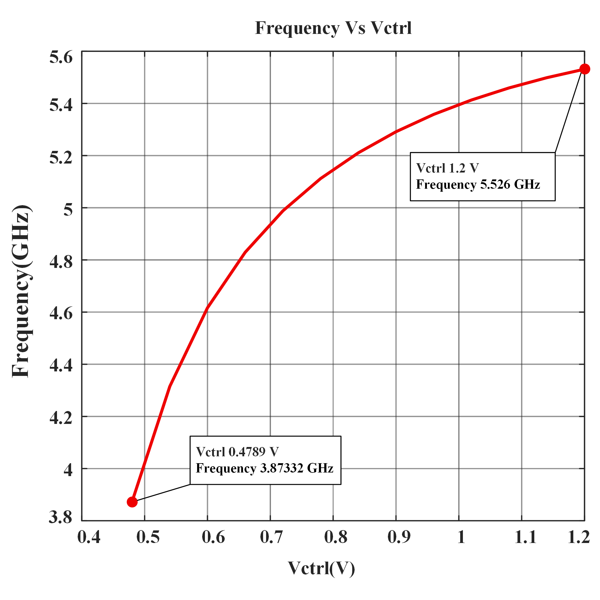
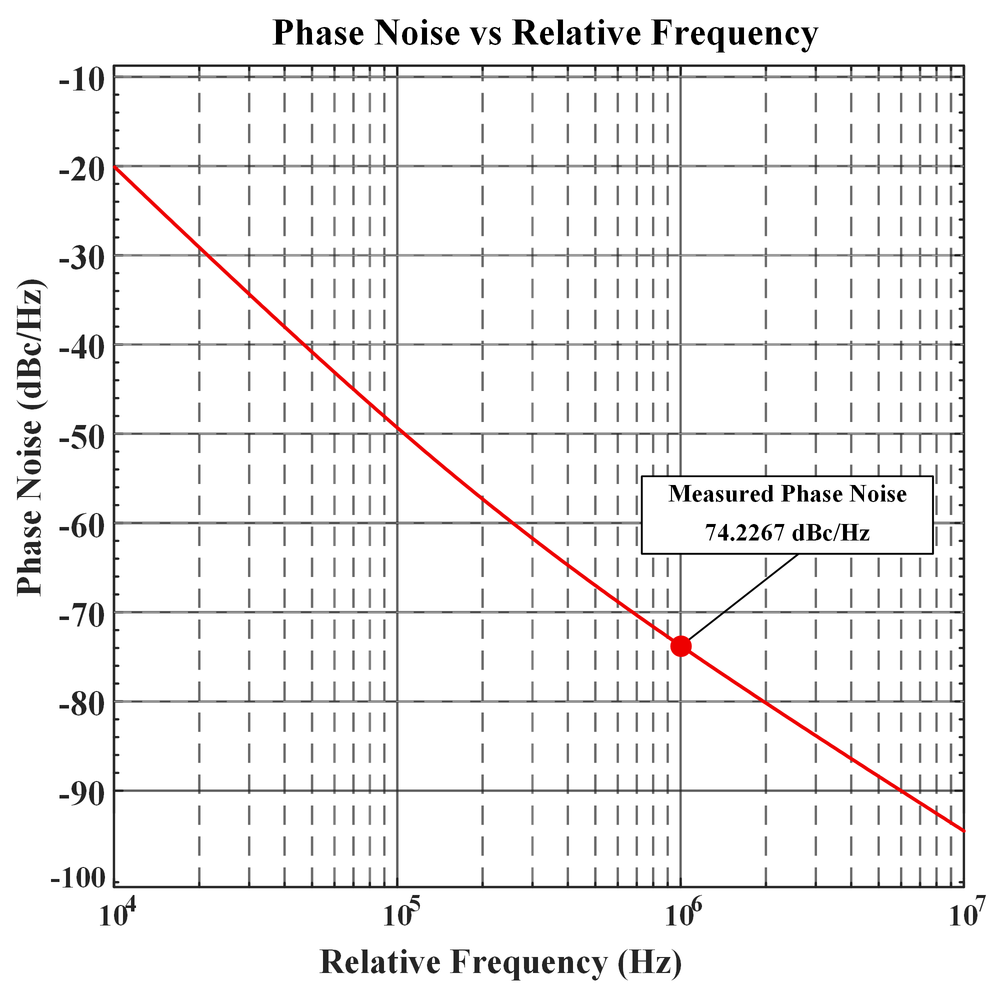
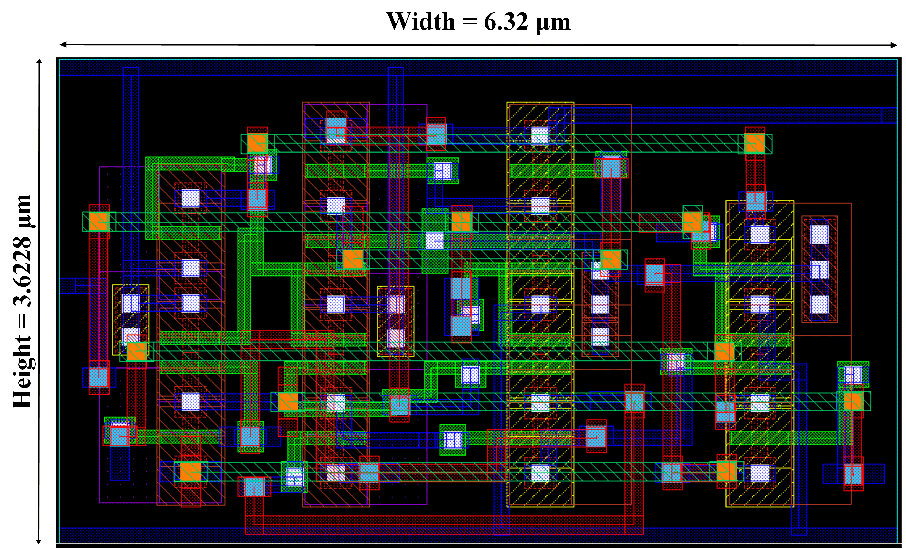

<div align="center">

# LECTOR-Based Current-Starved VCO
### 90 nm CMOS · Wireless IoT Networks


**Raisul Islam Ratul · Anindya Chanda Tirtha**  
Department of Electrical, Electronic and Communication Engineering  
Military Institute of Science and Technology (MIST), Dhaka, Bangladesh

📄 [Full Paper](paper/Raisul_Tirth_LECTOR_CS_VCO_90nm_CMOS.pdf)

</div>

---

## What This Project Is

A **Voltage-Controlled Oscillator (VCO)** is the heartbeat of any wireless transceiver — it generates the carrier frequency that everything else locks onto. For battery-powered IoT devices (wearables, smart sensors, wireless nodes), the VCO must oscillate at GHz frequencies while consuming as little power as possible.

The core problem: at **90 nm CMOS and below**, transistors leak current even when they're supposed to be OFF. This *subthreshold leakage* silently drains power and corrupts spectral purity — making conventional oscillator designs poorly suited for energy-constrained IoT applications.

**This work proposes a solution: the LECTOR-based CS-VCO.**

By embedding **LEakage ConTrol TransistORs (LCTs)** into every inverter stage of a current-starved ring oscillator, we suppress leakage at the source — achieving over **90% reduction in static power** while maintaining a 1.65 GHz tuning range covering Wi-Fi, Bluetooth, and sub-6 GHz 5G.

> To the best of our knowledge, this is the **first implementation and evaluation of a LECTOR-based CS-VCO** architecture in the context of IoT wireless networks.

---

## Repository Structure

```
LECTOR-Based-CS-VCO-90nm-CMOS/
│
├── README.md                                   ← You are here
│
├── paper/
│   └── Raisul_Tirth_LECTOR_CS_VCO_90nm_CMOS.pdf   ← Full IEEE-format paper
│
└── figures/
    ├── schematic/
    │   ├── lector_inverter_schematic.png           ← Fig 1: LECTOR inverter circuit
    │   └── cs_vco_three_stage_architecture.png     ← Fig 2: Proposed CS-VCO topology
    │
    └── simulation/
        ├── oscillation_frequency_curve.png         ← Fig 3: Transient / frequency output
        ├── frequency_tuning_curve.png              ← Fig 4: Vctrl vs Fosc (3.87–5.53 GHz)
        ├── phase_noise_profile.png                 ← Fig 5: Phase noise (−74.22 dBc/Hz)
        └── post_layout_drc_lvs.png                 ← Fig 6: DRC/LVS-clean layout
```

---

## Technical Background

### Why Current-Starved VCOs?

A **Current-Starved VCO (CS-VCO)** controls oscillation frequency by throttling the charging/discharging current of each delay stage with current-limiting transistors biased by a control voltage V<sub>ctrl</sub>. The advantages are simplicity, low supply voltage operation, and wide tuning range — making them popular for low-power RF design.

The disadvantage: in deep-submicron nodes, **subthreshold leakage** through nominally-OFF transistors becomes a dominant source of static power dissipation and noise.

### The LECTOR Technique

LECTOR inserts two extra transistors — the **Leakage Control Transistors (LCTs)** — between the pull-up and pull-down networks of a standard CMOS inverter. Their gates are **cross-coupled**: each LCT's gate is connected to the drain of the other, ensuring that at least one LCT is near cutoff for any input state.

| Input State | OFF Devices | Effect |
|---|---|---|
| V<sub>in</sub> = 0 (logic LOW) | MN1 + MP2 | Stacked resistance blocks leakage path to GND |
| V<sub>in</sub> = 1 (logic HIGH) | MN2 + MP1 | Stacked resistance blocks leakage path to VDD |

The **stacking effect** of multiple OFF-state transistors in series creates a much higher effective resistance than a single off device — exponentially suppressing subthreshold leakage while preserving full rail-to-rail output swing.

<div align="center">

### Fig 1 — LECTOR-Based Inverter Schematic



*Cross-coupled LCTs (MP2/MN2) create stacked OFF-state resistance, blocking leakage in both logic states without compromising voltage swing.*

</div>

---

## Proposed Architecture

The full oscillator is a **three-stage ring topology** where each delay stage replaces the standard CMOS inverter with a LECTOR-based inverter. Current-starving PMOS devices at each stage gate the charging current based on V<sub>ctrl</sub>, setting the oscillation frequency.

<div align="center">

### Fig 2 — Three-Stage CS-VCO with LECTOR Inverters



*Each of the three delay stages integrates a LECTOR inverter. The current-starving PMOS transistors (biased by V<sub>ctrl</sub>) throttle stage current to tune frequency from 3.87 to 5.53 GHz.*

</div>

### Design Parameters

| Parameter | Value | Rationale |
|---|---|---|
| Technology | 90 nm CMOS | Deep-submicron IoT integration |
| Supply Voltage (V<sub>DD</sub>) | 1.2 V | Standard low-power supply for 90 nm |
| Ring Stages | 3 | Minimum for oscillation; compact area |
| CS-PMOS Width | 960 nm | Balances current drive vs. leakage |
| CS-PMOS Length | 120 nm | Minimum channel for speed |
| Simulation Tool | Cadence Virtuoso | Industry-standard analog/RF EDA |

---

## Simulation Results

All simulations were carried out in **Cadence Virtuoso** with a calibrated 90 nm CMOS PDK.

### Oscillation Behavior

Transient analysis confirms stable, sustained oscillation from startup with:
- **Peak-to-peak amplitude:** 0.683 V
- **Startup time:** Steady state within the first few cycles
- **Oscillation frequency at V<sub>DD</sub> = 1.2 V:**

$$F_{osc} = \frac{1}{(468.24 - 284.11)\ \text{ps}} = 5.430\ \text{GHz}$$

Periodic Steady-State (PSS) analysis confirms no amplitude or frequency degradation over long-run operation.

<div align="center">

### Fig 3 — Oscillation Frequency Output



</div>

---

### Frequency Tuning

<div align="center">

### Fig 4 — Frequency Tuning Curve (V<sub>ctrl</sub> vs F<sub>osc</sub>)



</div>

| Metric | Value |
|---|---|
| Minimum Frequency | 3.873 GHz @ V<sub>ctrl</sub> = 0.479 V |
| Maximum Frequency | 5.526 GHz @ V<sub>ctrl</sub> = 1.2 V |
| **Tuning Range** | **1.653 GHz** |
| VCO Gain (K<sub>VCO</sub>) | ~2.45 GHz/V (low V<sub>ctrl</sub> region) |

The tuning range encompasses **IEEE 802.11a/n/ac (5 GHz Wi-Fi)**, **Bluetooth 5** (2.4 GHz harmonics), and **5G NR sub-6 GHz** bands — making this oscillator a single-design solution for multi-standard IoT radios.

---

### Phase Noise

<div align="center">

### Fig 5 — Phase Noise Profile



</div>

| Offset | Phase Noise |
|---|---|
| 1 MHz | **−74.22 dBc/Hz** |
| Slope (close-in) | 1/f³ (flicker-dominated) |
| Slope (far-out) | Flat thermal noise floor |

The LECTOR technique contributes to improved phase noise by stabilizing the bias current at each stage — leakage-induced current fluctuations that would otherwise modulate oscillation frequency are suppressed.

---

### Post-Layout Verification

<div align="center">

### Fig 6 — Post-Layout View (DRC/LVS Clean)



</div>

| Metric | Value |
|---|---|
| Silicon Area | **22.8965 µm²** |
| DRC | ✅ Pass |
| LVS | ✅ Pass |
| Post-layout vs. Schematic | ✅ Consistent |

Optimized routing minimizes parasitic capacitances, preserving high-frequency performance after layout extraction.

---

## Performance Summary

| Metric | Value |
|---|---|
| Oscillation Frequency | 5.470 GHz |
| Center Frequency | 4.699 GHz |
| Tuning Range | 3.873 – 5.526 GHz |
| **Power Consumption** | **95.472 µW** |
| Phase Noise @ 1 MHz offset | −74.22 dBc/Hz |
| **Figure of Merit (FoM)** | **−145.5 dBc/Hz** |
| Silicon Area | 22.8965 µm² |
| Supply Voltage | 1.2 V |
| Technology | 90 nm CMOS |

### Figure of Merit

$$\text{FoM} = \mathcal{L}\{\Delta f\} - 20\log\!\left(\frac{f_0}{\Delta f}\right) + 10\log\!\left(\frac{P_{DC}}{1\ \text{mW}}\right)$$

---

## Comparison Against Published Designs

| Ref | Architecture | F<sub>osc</sub> (GHz) | Tuning Range (GHz) | Power | PN @ 1MHz (dBc/Hz) | FoM (dBc/Hz) |
|:---:|---|:---:|---|:---:|:---:|:---:|
| [3] | Ring VCO | 1.56 | 0.30 – 1.60 | 0.14 mW | −90.68 | N/A |
| [4] | CS-CMOS VCO | 2.00 | 1.40 – 3.00 | 17.2 mW | −104 | −128.42 |
| [5] | IL-Ring VCO | 2.53 | 2.40 – 3.70 | 0.18 mW | −105 | −162.78 |
| [6] | Ring / CS-VCO | 2.58 | 2.00 – 2.60 | 0.016 mW | −67 | −128.75 |
| [7] | Quadrature Osc. | 4.90 | 2.66 – 4.97 | 8.5–16 mW | −107.5 | −157.30 |
| [10] | NMOS Sink CS-VCO | 7.83 | 2.82 – 7.80 | 3.00 mW | −73.43 | −141.14 |
| [2] | CS-VCO (baseline) | 2.00 | 0.742 – 3.92 | 6.885 mW | −139.69 | −187.38 |
| **Ours** | **LECTOR CS-VCO** | **5.470** | **3.873 – 5.526** | **95.47 µW** | **−74.22** | **−145.5** |

**Key takeaways:**
- **72× lower power** than the conventional CS-VCO baseline [2] (6.885 mW → 95.47 µW)
- **31× lower power** than the nearest ring VCO [3] at a 3.5× higher frequency
- Operates in the **5 GHz IoT band** — most comparators work below 3 GHz
- Competitive FoM despite ultra-low power operation

---

## Why This Matters for IoT

| IoT Requirement | This Design |
|---|---|
| Battery life | **95.47 µW** — orders of magnitude below mW-class oscillators |
| Multi-standard support | 3.87–5.53 GHz covers Wi-Fi 5, Bluetooth 5, 5G NR sub-6 |
| SoC integration | 22.9 µm² compact area, DRC/LVS clean |
| Manufacturability | Standard 90 nm CMOS — no exotic process |
| Startup reliability | PSS-verified — robust under duty-cycle operation |

The combination of ultra-low power, wide tuning range, and silicon-proven layout makes this architecture directly applicable to **autonomous IoT sensor nodes, wearables, and smart home devices** where replacing a battery is inconvenient or impossible.

---

## Future Directions

- Integration with a **Phase-Locked Loop (PLL)** for fully synthesized frequency generation
- Migration to **45 nm / 28 nm** nodes to further suppress leakage and extend frequency range
- Fabrication and **silicon measurements** to validate post-layout predictions
- Exploration of **differential LECTOR topologies** for improved common-mode noise rejection

---

## Citation

If you use this work, please cite:

```bibtex
@article{ratul2024lector,
  title     = {Design and Implementation of a Low-Power LECTOR-Based
               Current-Starved VCO in 90 nm CMOS for Wireless IoT Networks},
  author    = {Ratul, Raisul Islam and Tirtha, Anindya Chanda},
  journal   = {MIST — Department of EECE},
  year      = {2024},
  note      = {Implemented in Cadence Virtuoso, 90 nm CMOS}
}
```

---

## Authors

| | |
|---|---|
| **Raisul Islam Ratul** | ratulraisul3@gmail.com |
| **Anindya Chanda Tirtha** | anindyatirtha5@gmail.com |

**Institution:** Military Institute of Science and Technology (MIST), Dhaka, Bangladesh  
**Department:** Electrical, Electronic and Communication Engineering

---

<div align="center">

*Designed and simulated in Cadence Virtuoso · 90 nm CMOS · MIST, Dhaka*

</div>
